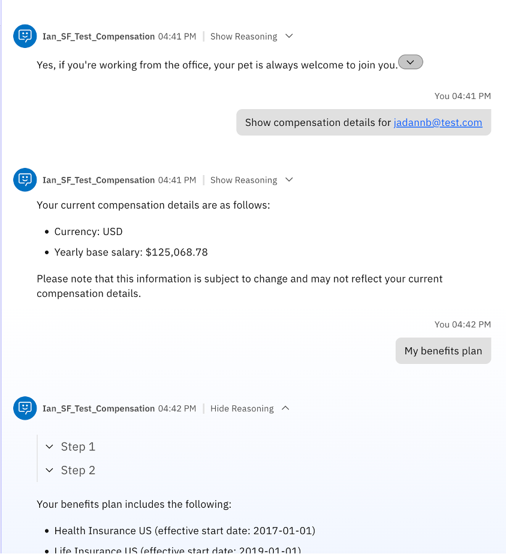

# Using Prebuilt Agents and Tools
## Objective

The IBM watsonx Orchestrate catalog serves as a vast repository of prebuilt AI agents and tools, tailored to address a wide array of use cases and requirements. This extensive collection helps you to discover agents, tools, or a blend of both that align with your specific needs. In this lab, we will use one of the prebuilt agents to demonstrate how easy for a user to start the agent building journey.

Each watsonx Orchestate prebuilt agents and tools are connected to a service. Services require connections to be established. For this lab, we have already created the necessary connections.
Key features of prebuilt agents include:
•	Pre-configured: Prebuilt agents come with pre-defined settings and configurations for easy setup
•	Reusable: Prebuilt agents can be used across multiple workflows, reducing the need to recreate similar tasks
•	Task-specific: Each prebuilt agent is designed to perform a specific task or set of tasks, such as data processing, API calls, or notifications.
## Discovering the Catalog

1.	From the hamburger menu on the top left corner, select “Discover”

    
2.	You will be presented with this view

    
3.	Currently, all the prebuilt agents and tools are separated into 4 domains/categories. Feel free to click on one of the categories and see what is available for you. 
4.	In this lab, we will be using one of the prebuilt agents from the HR category.
5.	Go back to the hamburger menu and click on “Discover” again if you’ve navigated away. 
6.	On the search bar, search for “Employee Address” and hit Enter. Click on the Employee Address once the search result comes back.

    
7.	Once you clicked on the Employee Address, you will be presented with this view

    
8.	You will be able to see what this agent is doing, the tools it is using. From this page, we will be able to assess if this agent is suitable for your use case.
9.	To use this agent, click on the “Use as template” button on the top right.

    
10.	 You will be presented with the Agent Builder page
 
     

11.	 Edit the name so that it is unique. Change the agent’s name to [Your Initial]_Employee Address and save.

     

12.	 Keep the rest of the agent set up as it is and let’s try the agent.
13.	In the “Preview” panel on the right, let’s try one query.
    ```
    Update my address
    ```

     

14.	 If you face any problem with step 13, please alert one of your friendly instructors.
15.	Prebuilt agents present an easy way to build an agent. However, we can also edit the prebuilt agent. Let’s try to add an extra tool into the agent. 
16.	Scroll down to the toolset and click on “Add tool”.

     

17.	Click on “Add from catalog”.

     

18.	On the search bar, type in “Personal Details”. Select “Get personal details in SAP SuccessFactors” from the search result.

     

19.	 After you click on the tool, you will be able to see the input and output the tool is expecting. Once you’re ready, click on “Add to agent” on the bottom right.

     

20.	Once return to the agent builder page, you will see the additional tool added to the tools list.

     

21.	After building the agent, we can deploy our agent. Click in the “Deploy” button on the top right. Keep all default settings when being asked.

     

22.	 Once the deployment is ready, navigate to “Chat” from the left hand hamburger menu.
23.	From the drop down menu, select your agent.

     

24.	Let’s try out the agent. Here are some queries you can use.
    
    a.	
    ```
    Get personal details for jamie.tan@bestrun.sg
    ```
     

    b.
   	```
    Update my address
    ```

     

    When asked, you can use any address and any start date. 
    Country code must be SGP.
    If you are asked to input an email address, use jamie.tan@bestrun.sg
        
     

        Input yes when asked for confirmation.
26.	Let’s try another prebuilt agent. Navigate to “Discover” from the left hand hamburger menu. Type in Compensation Successfactors .
    Select the Agent with SAP SuccessFactor.
    
     

27.	Click on “Use as Template”

     


28.	Edit the Agent’s name to become [Your Initial]_Compensation.

     
 
29.	Let’s try the agent on preview. Type the question below:
    ```
    Can I bring a pet to the office
    ```
30.	The agent will not be able to answer the above question as it doesn’t have the right tool. In the next few steps, we will demonstrate how you can upload a document on the chat interface to find quick answers to questions.
31.	Scroll down along the agent settings until you see the “Chat with document” section. Toggle to switch it on.\

     

32.	Deploy the agent by clicking on “Deploy” on the top right corner.
33.	Once the deployment is ready, navigate to “Chat” from the left hand hamburger menu.
34.	Search for your Compensation agent from the drop down menu.

     

35.	You should notice an upload document icon on the chat input bar

     

36.	Download the following document to your laptop. Then click the upload document icon and look for the Employees-Benefit.pdf document

     

37.	Now, ask the same question:
    ```
    Can I bring a pet to the office
    ```
38.	It will take some time to process the document, but you will see that your Compensation agent is able to answer the question.

     

39.	Note that the document is only available to the agent for the current chat session.
40.	The agent will still work with existing tool. Try queries such as:
    ```
    Show compensation for jadannb@test.com
    ```
    ```
    My benefit plans
    ```
     
 

## **Conclusion**

The above practice is to demonstrate the ease to build an agent using prebuilt templates and to edit the agent with extra tools or external documentation to help with the agent’s answer.
