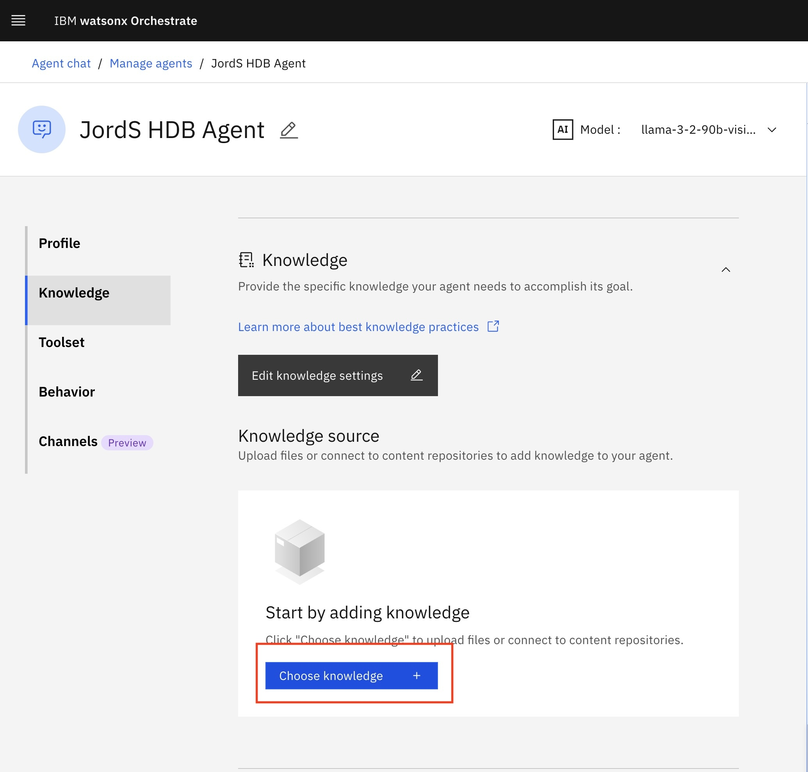
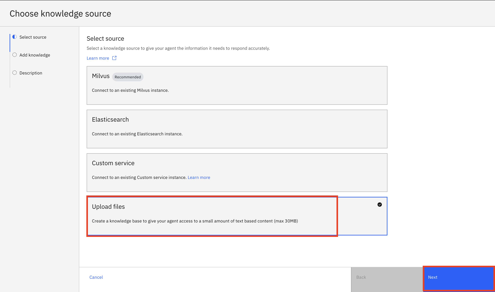
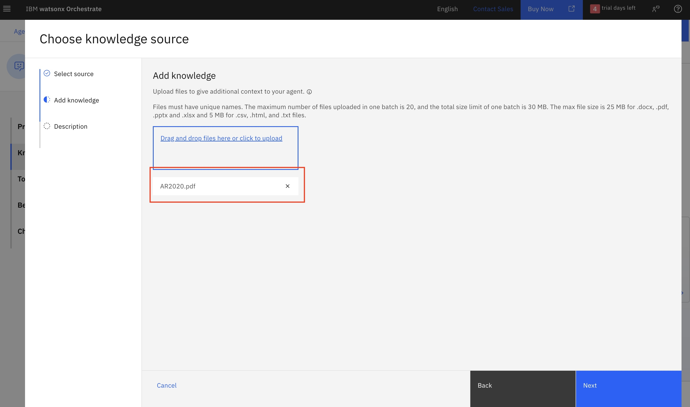
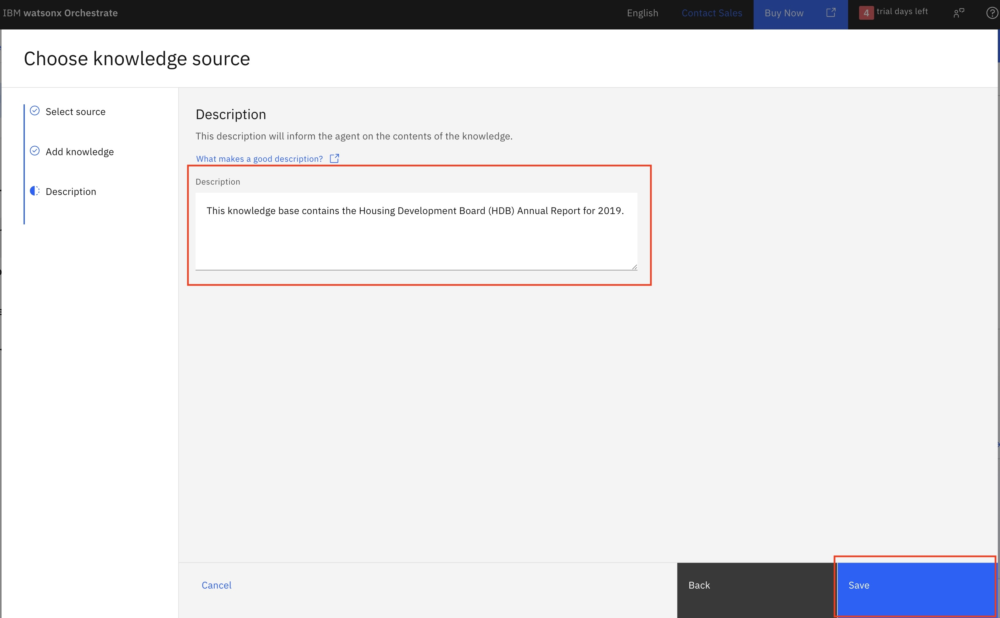
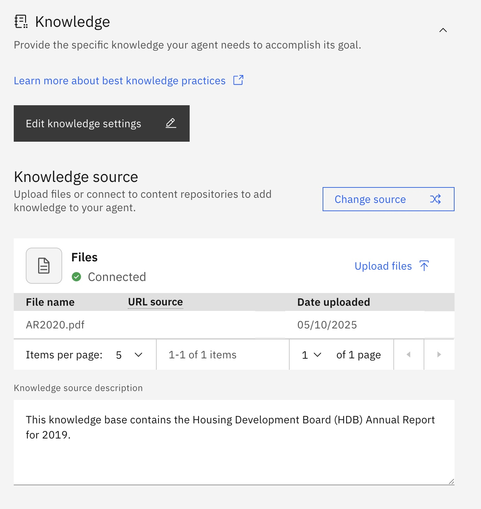
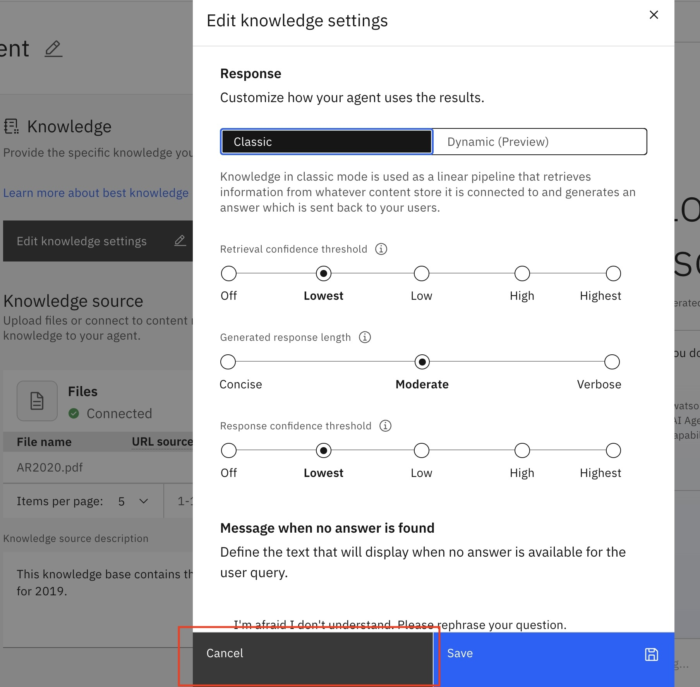
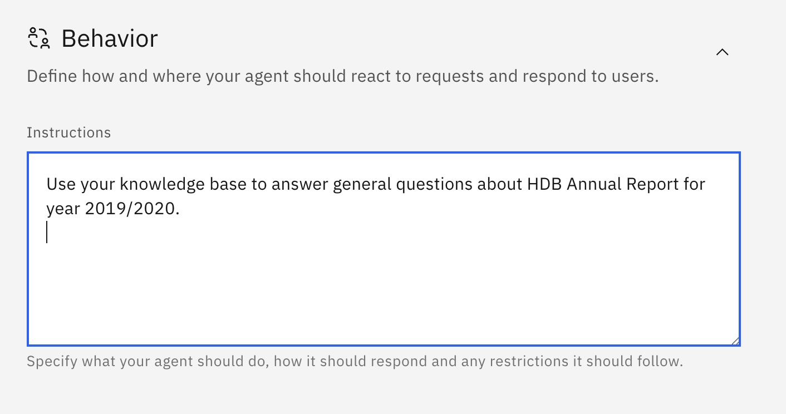
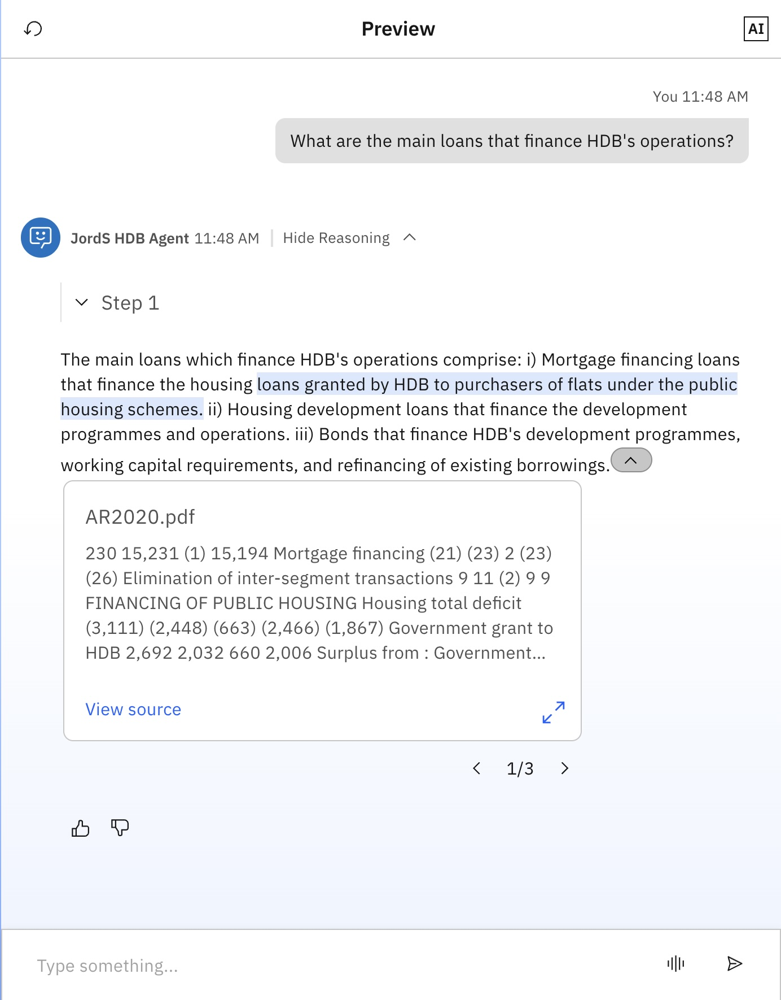
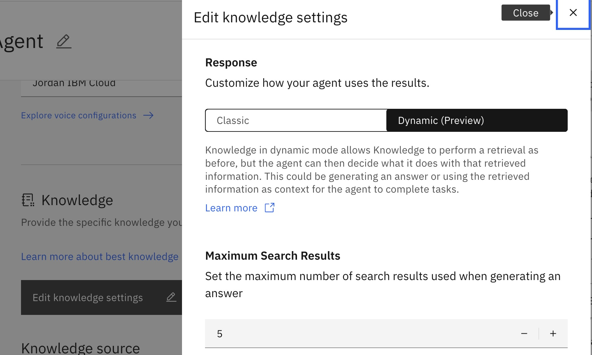
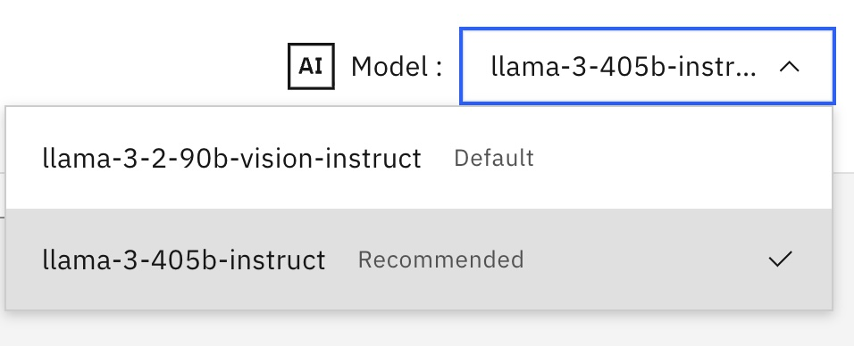

# 🧑‍💼 Lab 2: Agentic RAG with HDB Annual Report 
    
In this lab, we will build a HDB Annual Report agent in watsonx Orchestrate to answer questions based on a knowledge base. This agent retrieves relevant information from documents to answer user queries.


## Step by step instructions to build the HDB Agent:

1. When you launch watsonx Orchestrate, you'll be directed to this page. Click on the hamburger menu in the top left corner:

    

1. Click on the down arrow next to **Build**.  Then click on **Agent Builder**:

    

1. Click on **Create agent +**:

    

1. Select "Create from scratch", give your agent a unique name (make sure to identify yourself by your initials or name, since this is a shared instance), e.g. "[Your Initial] HDB Agent", and fill in the description as shown below: 

    ```
    You are an agent who handles employee queries from the HDB Annual Report.  You provide short and crisp responses, keeping the output to 200 words or less. 
    ```  

    Click on **Create**:

    

## Lab 2A: Agentic RAG with HDB Annual Report 

1. We are going to build a knowledge base for the agent. Scroll down the screen to the **Knowledge** section and click on "Choose knowledge".

    

1. Choose "Upload files" and click "Next".

    

1. Drag and drop the [Employee Benefits.pdf](./pdfs/AR2020.pdf) and click on **Next**:

    

1. Copy the following description into the **Description** section and click **Save**:

    ```
    This knowledge base contains the Housing Development Board (HDB) Annual Report for 2019. 
    ```

    

    The knowledge base will take some time to create. After the knowledge base is done, you will be brought back to the Agent Builder UI.

    

1. Click into the **Edit knowledge settings** section. You can explore the settings like: Retrieval confidence threshold, Generated response length, Response confidence threshold, Maximum Search Results and number of Citations. There is also a Dynamic mode. Click back into "Classic" and leave it as default settings by clicking on "Cancel". 

    

1. Scroll down to the **Behavior** section. Insert the instructions below into the **Instructions** field:

    ```
    Use your knowledge base to answer general questions about HDB Annual Report for year 2019/2020.  
    ```

    

1. Test your agent in the preview chat on the right side by asking the following questions and validating the responses.  They should look similar to what is shown in the screenshot(s) below:

    ```
    What are the main loans that finance HDB's operations?
    ```

    

1. You can try the following sample questions as well:

    ```
    Summarise the land reclamation projects ongoing and successfully completed in the past year according to AR2020
    ```
    ```
    According to the AR2020.pdf document, how many international awards were attained for the year 2019?
    ```
    ```
    List the buildings that received the BCA Construction Excellence Award 2019 (Residential Buildings – Below $1,800 /m2 Category)
    ```

    You can also try:
    1) to switch the knowlege settings to "Dynamic"
        

    2) to change the underlying LLM
        
    

    You have now built an AI Agent in under 10 minutes. Notice that you might not get all the correct answers. We will improve the search and build a better agent in Lab 2B below!

**Congratulations! You've built your first Agentic RAG Agent.**


## Lab 2B: Agentic RAG with Enterprise Search

In this part of the lab, we will change the source of the knowledge base.