🧑‍💼 AskHR Lab 3: Multi-Agent Collaboration
=================================================================================

In the final lab, we will extend our AskHR agent to be even more powerful by using its multi-agent capabilities. In particular, we'll add one more specialized agents as collaborator for our primary HR Agent.

*   The agent will specializes in questions about an employee's health insurance plan

Note that in this agent, you will be using some pre-imported tools (rather than importing them yourself).

Step-by-step instructions
=========================

1.  Go Back to "Manage Agents"  
    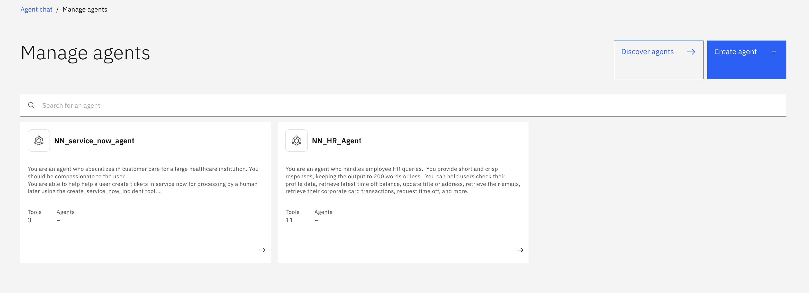
1.  Click "Create Agent"
1.  Type the following:  
    Name: \[Your Initials\]\_employee\_healthcare\_agent  
    Description:
    ```
    You are an agent who specializes in customer care for a large healthcare institution. You should be compassionate to the user.
    You are able to answer questions around benefits provided by different plans, the status of a claim, and are able to help direct people to the nearest provider for a particular ailment.
    ```
    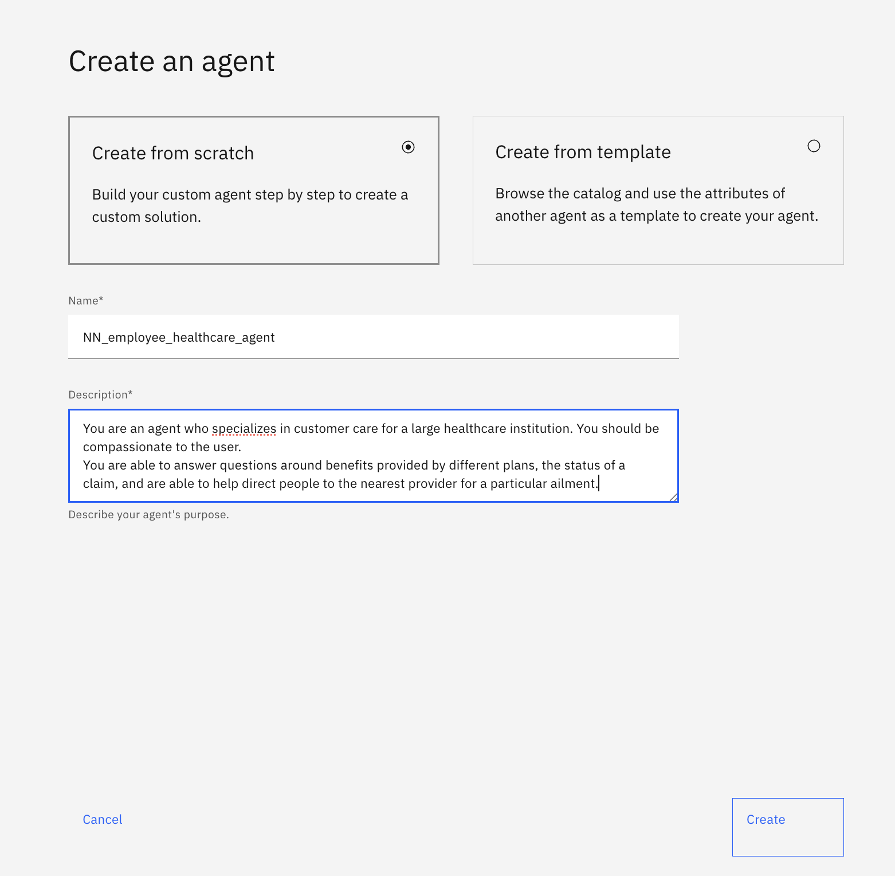 
1.  Once the \[your\_initials\]\_employee\_healthcare\_agent has been created, scroll down to Toolset > Add Tool and add the following tools from local instance 
    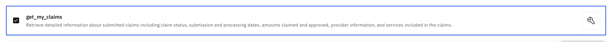
    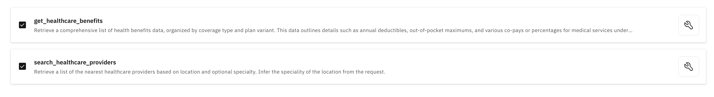
1.  Go back to "Manage Agents"
1.  Click back into \[Your\_Initial\]\_HR\_Agent agent.

    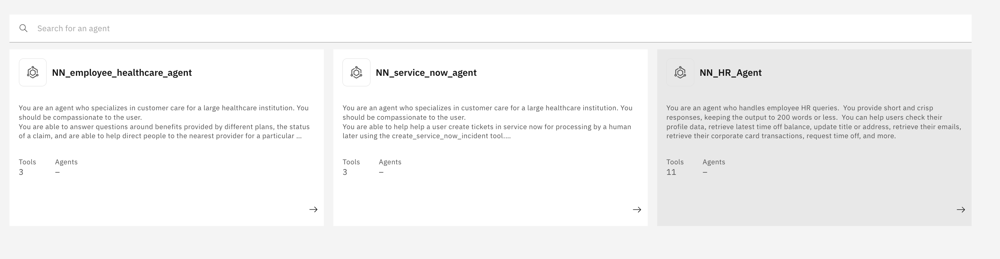
1.  Scroll down to Toolset > Agents and click "Add agent" button  

    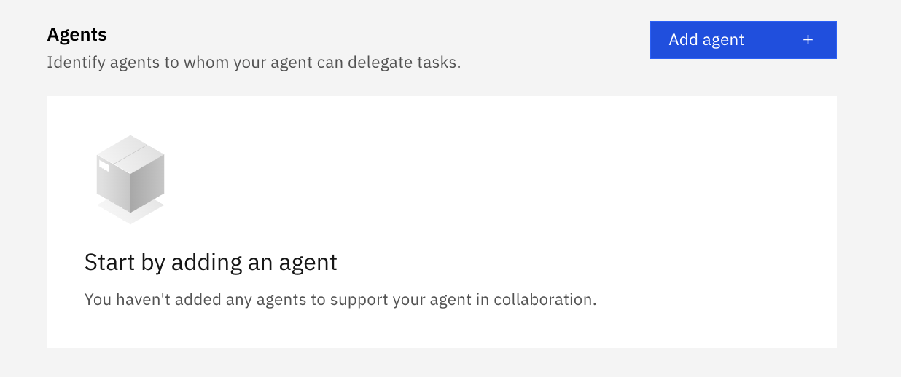
1.  Click "Add from local instance"  

    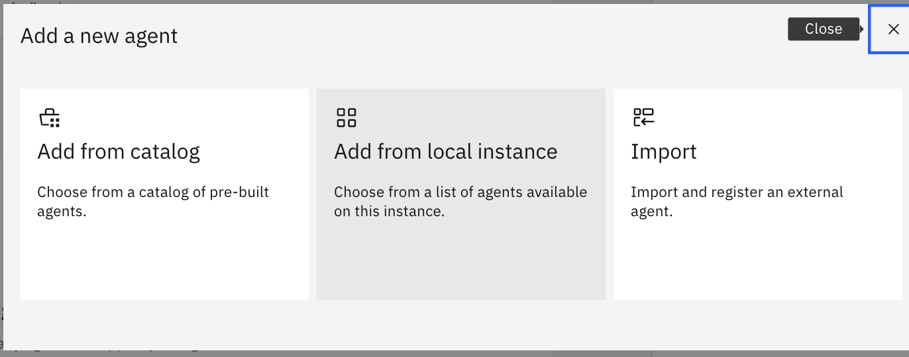
1.  Add the \[Your Initials\]\_employee\_healthcare\_agent as collaborators.

    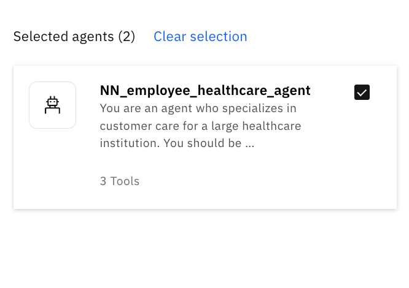
1.  Scroll up & update the agent **Description**:
    ```
    You are an agent who handles employee HR queries. You provide short and crisp responses, keeping the output to 200 words or less. You can help users check their profile data, update their addresses within the SAP system.You can also reroute to an employee_healthcare_agent for answering questions related to employee health insurance policies, providers/doctors, medical claims.
    ```
1.  Next, we will also add in the Employee Address prebuilt agent which we've created in Lab 1.
1.  Scroll down to Agents and click on **Add agent**.

    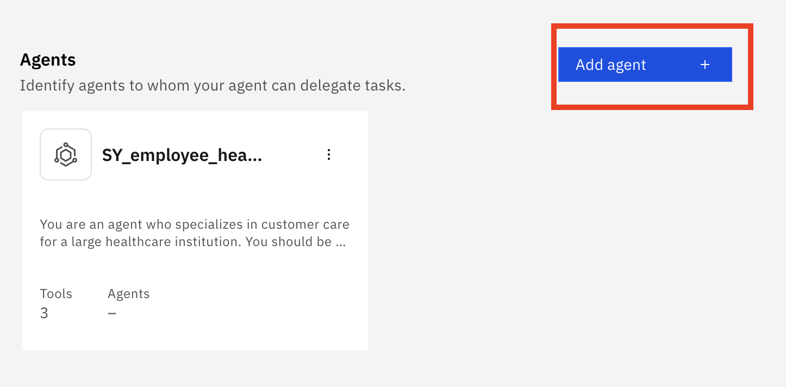

1. Click on **Add from local instance**.
    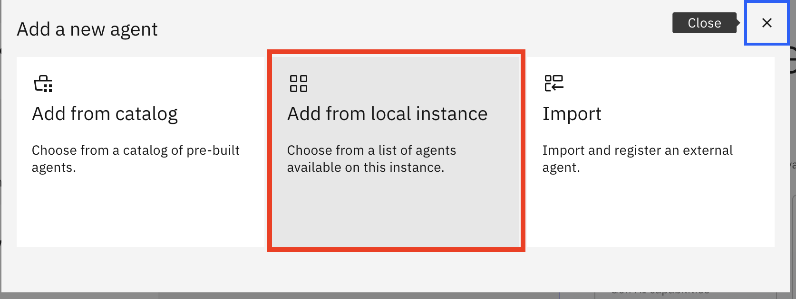

1. Search for \[Your\_Initial\]\_Employee Address, select the relevant agent and click **Add to agent**.
    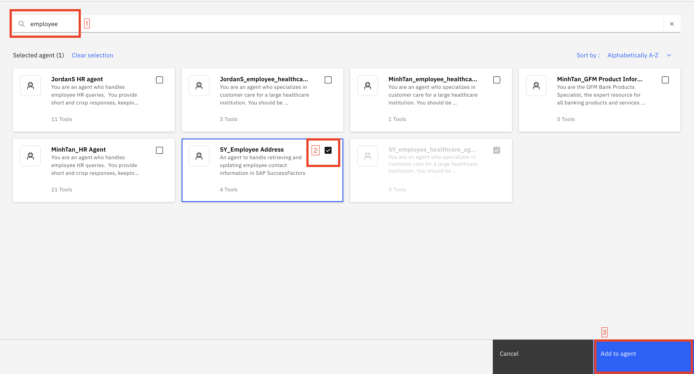

1. Repeat the steps to add Leave Management Agent
    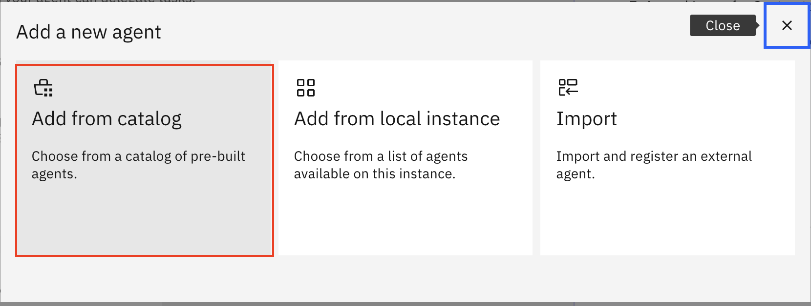

    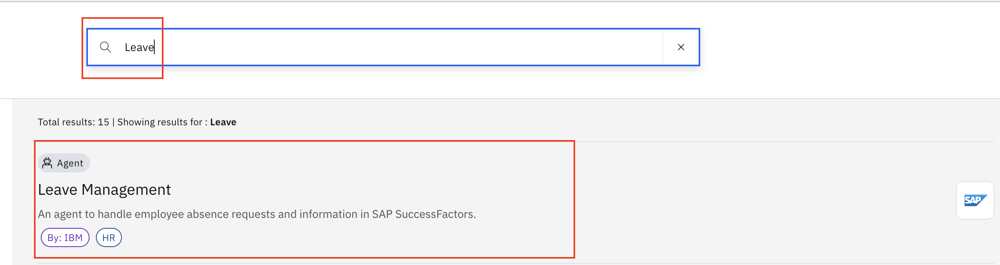

    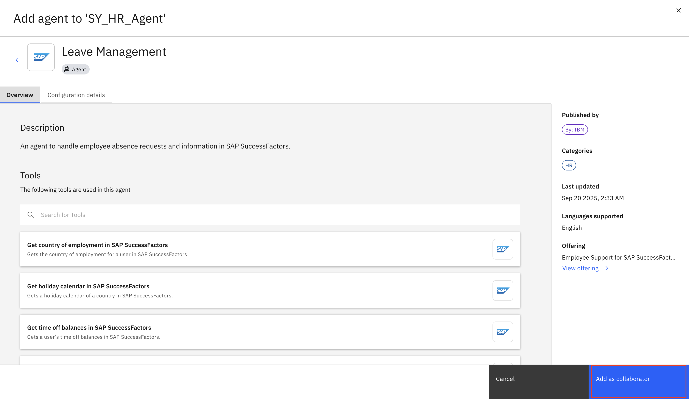
1. Scroll down and update the agent **Behavior**
    ```
    Use your knowledge base to answer general questions about employee benefits. For any questions related to benefits/incentives that are unrelated to healthcare, refer to your KNOWLEDGE.
    
    Reroute to the employee_healthcare_agent for any queries related to healthcare, medical appointments, healthcare providers (doctors), and health insurance, and use the outputs from this agent to respond.
    
    Reroute to the Employee Address agent when there are any request to update address of an employee. Ensure that you have all the information before you trigger the agent. If you need more information, get it from user.

    If the user wants to request for leave, route it to Leave Management agent. The location used must be SGP. Ensure that you have all the information before you trigger the agent. If you need more information, get it from user.

    After rerouting to any agent, be sure to return the agent's output in any subsequent query to the supervisor agent.
    ```
1.  Next let's refresh the page and then test our end-to-end AskHR demo.
    Your results should mostly match the results in the **demo\_video.mov** within this folder.
    > **Note**: if you are prompted for any name or email address, say "jamie.tan@bestrun.sg".
    ```
    I want to apply for childcare leave for a day
    ```
    ```
    jamie.tan@bestrun.sg
    ```
*   Feature demonstrated: call a prebuilt collaborator agent
    ```
    I need to bring my son for a follow up appointment with his specialist for his ear infection. Can you remind me of what would be my copayment amount if I’m under HDHP in-network?
    ```
*   Feature demonstrated: reroute to collaborator agent & call tool
    ```
    I wanted to bring him to a different doctor this time - for a second opinion - can you recommend one near Lowell?
    ```
*   Feature demonstrated: reroute to collaborator agent & call tool
    ```
    I also need to update my address
    ```

How to Deploy \[OPTIONAL\]
==========================

1.  Deploying is as simple as clicking the blue "Deploy" button on the top right.
