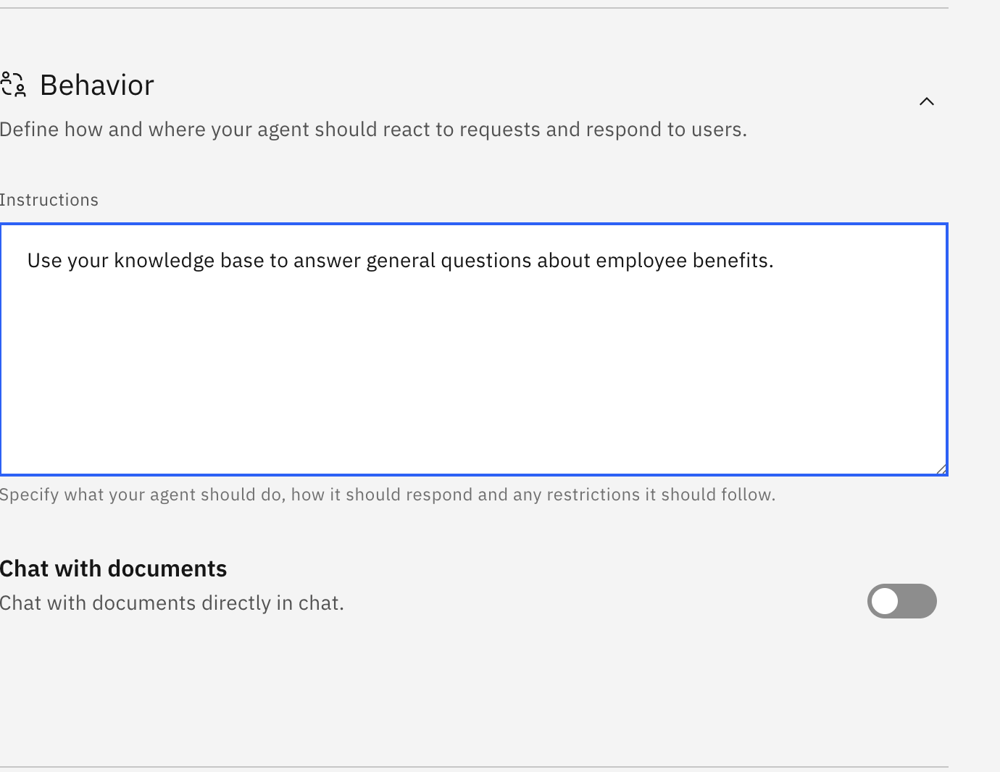

# 🧑‍💼 AskHR: Automate HR tasks with Agentic AI (Lab 2: Building a simple RAG agent)
    
## Use Case Description


In this lab, we will enable our HR agent in watsonx Orchestrate to answer questions based on a knowledge base. This agent retrieves relevant information from documents to answer user queries.

We will make this agent more powerful with more tools and access to APIs in lab3b, and enable it to collaborate with other agents in lab3c.


## Step by step instructions to build the HR Agent:

1. When you launch watsonx Orchestrate, you'll be directed to this page. Click on the hamburger menu in the top left corner:

    

1. Click on the down arrow next to **Build**.  Then click on **Agent Builder**:

    

1. Click on **Create agent +**:

    

1. Select "Create from scratch", give your agent a unique name (make sure to identify yourself by your initials or name, since this is a shared instance), e.g. "[Your Initial]_HR Agent", and fill in the description as shown below: 

    ```
    You are an agent who handles employee HR queries.  You provide short and crisp responses, keeping the output to 200 words or less. You can answer general questions about company benefits.
    ```  

    Click on **Create**:

    

1. Scroll down the screen to the **Knowledge** section. Copy the following description into the **Knowledge Description** section:

    ```
    This knowledge base addresses the company's employee benefits, including parental leaves, pet policy, flexible work arrangements, and student loan repayment.
    ```

    Click on **Upload files**:

    

1. Drag and drop the [Employee Benefits.pdf](/f1-week-sg-techxchange/pdfs/Employee-Benefits.pdf) and click on **Upload**:

    

1. Wait until the file has been uploaded successfully and double check that it is now shown in the Knowledge section: 

    


1. Scroll down to the **Behavior** section. Insert the instructions below into the **Instructions** field:

    ```
    Use your knowledge base to answer general questions about employee benefits. 
    ```

    

1. Test your agent in the preview chat on the right side by asking the following questions and validating the responses.  They should look similar to what is shown in the screenshot(s) below:

    ```
    1. What is the pet policy? 

    ```

    