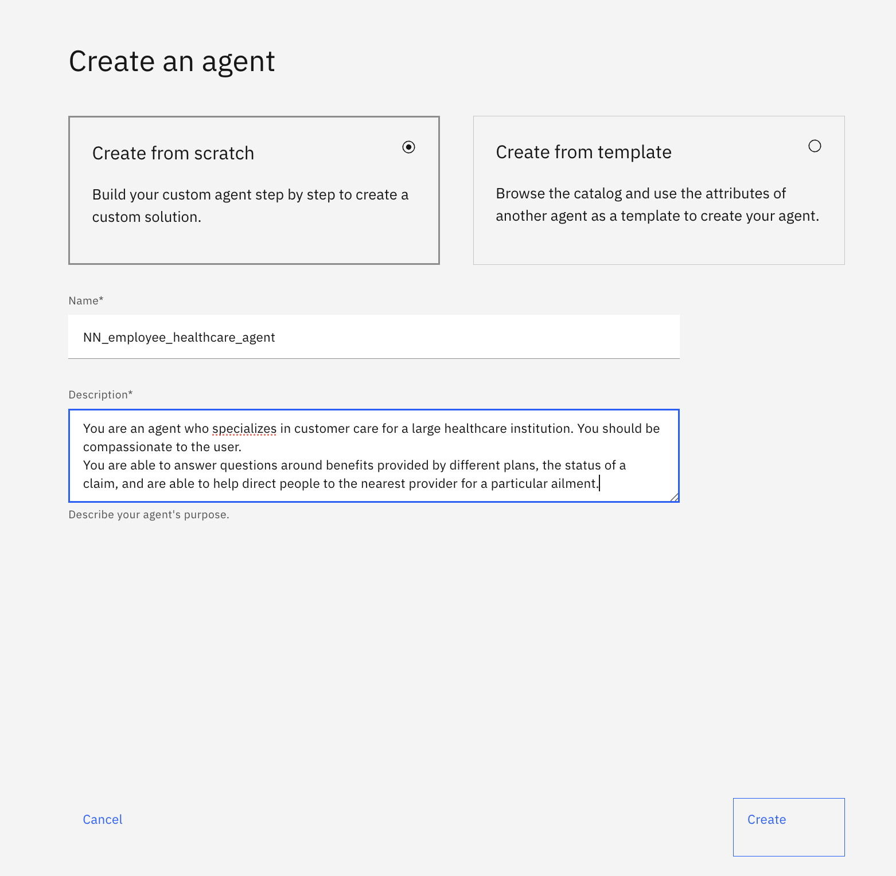
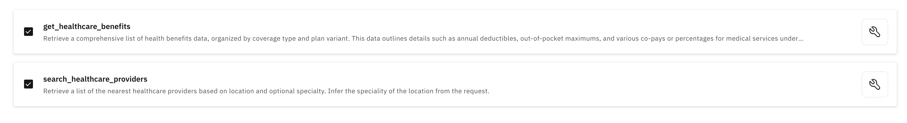
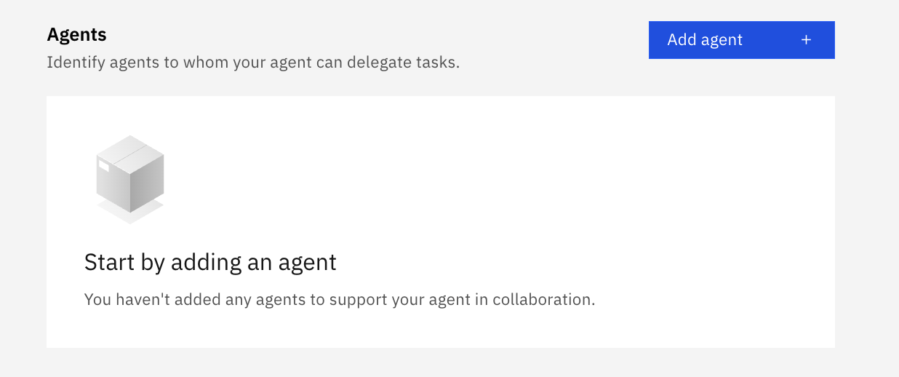
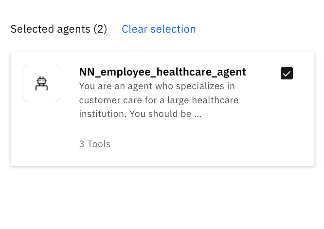

🧑‍💼 AskHR: Automate HR tasks with Agentic AI (Lab 3: Multi-Agent Collaboration)
=================================================================================

In the third and final subsection of our AskHR lab, we will extend our AskHR agent to be even more powerful by using its multi-agent capabilities. In particular, we'll add one more specialized agents as collaborator for our primary HR Agent.

*   The agent will specializes in questions about an employee's health insurance plan

Note that in this agent, you will be using some pre-imported tools (rather than importing them yourself as in Lab 3b)

Step-by-step instructions
=========================

1.  Go Back to "Manage Agents"  
    
1.  Click "Create Agent"
1.  Type the following:  
    Name: \[Your Initials\]\_employee\_healthcare\_agent  
    Description:
    ```
    You are an agent who specializes in customer care for a large healthcare institution. You should be compassionate to the user.
    You are able to answer questions around benefits provided by different plans, the status of a claim, and are able to help direct people to the nearest provider for a particular ailment.
    ```
     
1.  Once the \[your\_initials\]\_employee\_healthcare\_agent has been created, scroll down to Toolset > Add Tool and add the following tools from local instance 
    
    
1.  Go back to "Manage Agents"
1.  Click back into \[Your\_Initial\]\_HR\_Agent agent.
    
1.  Scroll down to Toolset > Agents and click "Add agent" button  
    
1.  Click "Add from local instance"  
    
1.  Add the \[Your Initials\]\_employee\_healthcare\_agent as collaborators.
    
1.  Scroll up & update the agent **Description**:
    ```
    You are an agent who handles employee HR queries. You provide short and crisp responses, keeping the output to 200 words or less. You can help users check their profile data, retrieve latest time off balance, update title or address, retrieve their emails, retrieve their corporate card transactions, request time off, and more.
    You can also reroute to an employee_healthcare_agent for answering questions related to employee health insurance policies, providers/doctors, medical claims.
    ```
1.  Scroll down and update the agent **Behavior**
    ```
    Use your knowledge base to answer general questions about employee benefits. For any questions related to benefits/incentives that are unrelated to healthcare, refer to your KNOWLEDGE.
    
    Use the tools to get or update user specific information.
    
    When user asks to show profile data or check time off balance or update title/address or request time off for the very first time, first ask the user for their name, then invoke the tool and then use the same name in the whole session without asking for the name again.
    
    When user request for time off for the very first time, you must ensure that you have name, leave start date and leave end date before using the tool. If you do not have the information, clarify with the users. Convert the dates to YYYY-MM-DD format
    
    For multiple requests, always use the same name throughout the session.
    
    Always reply in a friendly and complete sentence.
    
    Do not ever call tools, unless you are sure of the correct input parameters. If you are not sure, or have incomplete information (such as a missing user/employee name, request it from the user first)
    
    For the following tools, please ensure that you know the employee name and if you do not, request the name (do not assume):
    - get_emails
    - get_corporate_card_transactions
    - user_profile_details
    - update_address
    - update_title
    - request_time_off
    - time_off_balance
    
    Reroute to the employee_healthcare_agent for any queries related to healthcare, medical appointments, healthcare providers (doctors), and health insurance, and use the outputs from this agent to respond.
    
    After rerouting to any agent, be sure to return the agent's output in any subsequent query to the supervisor agent.
    ```
1.  Next let's refresh the page and then test our end-to-end AskHR demo.
    Your results should mostly match the results in the **demo\_video.mov** within this folder.
    **Note**: if you are prompted for your name, say "Victoria Baker".
    ```
    check my leave balance
    ```
    ```
    Victoria Baker
    ```
*   Feature demonstrated: call tool directly
    ```
    I need to bring my son for a follow up appointment with his specialist for his ear infection. Can you remind me of what would be my copayment amount if I’m under HDHP in-network?
    ```
*   Feature demonstrated: reroute to collaborator agent & call tool
    ```
    I wanted to bring him to a different doctor this time - for a second opinion - can you recommend one near Lowell?
    ```
*   Feature demonstrated: reroute to collaborator agent & call tool
    ```
    i need to request leave to bring him to the doctor on 2025-06-25.
    ```

How to Deploy \[OPTIONAL\]
==========================

1.  Deploying is as simple as clicking the blue "Deploy" button on the top right.