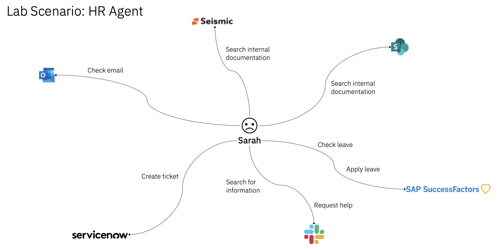
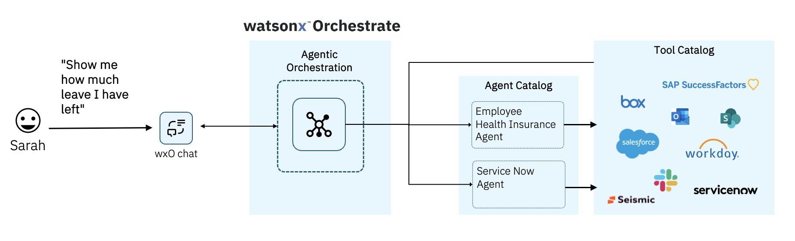
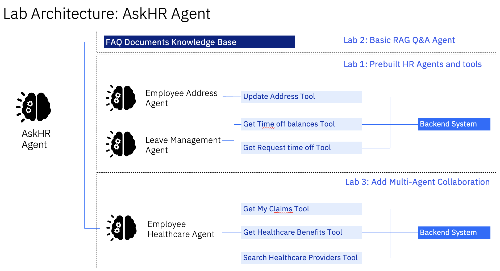

# Getting Started
1. These labs are for lab participants of IBM TechXperience Workshop.
1. Ensure you have an IBM ID and access to a watsonx orchesetrate environment provided by the instructor.
1. Follow the instructions in Labs 1, 2 and 3.

# Lab 1 Scenario: AskHR Agent

Jamie, an employee at Bestrun Corp, spends significant time navigating her company’s HCM system and various policy documents to perform HR-related tasks such as updating her mailing address, obtain information on her benefits and getting answers on office policies. 

### As-Is
When Jamie needs answers or needs to complete a task, she must first determine where the information lives — her email inbox, internal documentation, HCM, etc — and then manually search through each.

She wastes time toggling between tabs, copying data between systems, and often repeats these tasks daily.

### To-Be
Jamie simply types a question in plain English (e.g., “Show me how much leave I have left” or “Get my corporate card transactions”), and watsonx Orchestrate intelligently retrieves and summarizes relevant data across systems like email, internal documentation, ServiceNow, and HCM

Instead of juggling tabs, Jamie works from one smart interface where common tasks like leave requests, profile updates, or submitting expense claims are done quickly and conveniently

# Lab 2A: Agentic RAG with HDB Annual Report 
This scenario is separate from Lab 1. You will get to try the low code capability of watsonx Orchestrate by building a simple RAG agent in a few steps. You will upload the PDF and use the in-built native document search capabilities. 

Suitable for business users. 

# Lab 2B: Advanced Agentic RAG 
Lab 2B is an advanced version of Lab 2A. Through the UI, you will get to connect with an existing enterprise search tool - Elasticsearch. The HDB Annual Report has been extracted, chunked and vectorized before loading into a vector index in Elasticsearch. You will be search through the sample queries with great accuracy.

Suitable for business users (with help from AI engineers for vector db setup)

# Lab 3: Using Collaborator Agents to Implement a Healthcare Insurance Provider AI Agent
You will get to experience how data scientist/AI engineers can build multi-agents in pro code fashion.

Suitable for AI Engineers or Developers.

<!-- # Lab Architecture
We will be building an AskHR Agent that allows Jamie to be able to ask Q&A about employee benefits, perform tasks such as update her mailing address, apply for leaves and even search for healthcare clinics all in one platform.  -->

<!--  -->