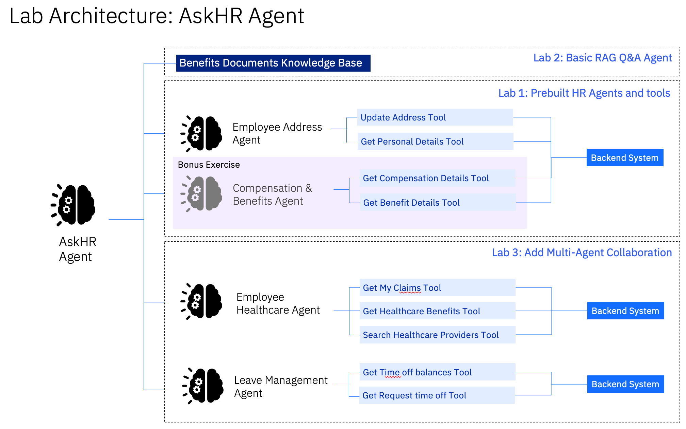

# Getting Started
1. These labs are for lab participants of IBM TechXperience Workshop.
1. Ensure you have an IBM ID and access to a watsonx orchesetrate environment provided by the instructor.
1. Follow the instructions in Labs 1, 2 and 3.

# Lab Scenario: AskHR Agent

Jamie, an employee at Bestrun Corp, spends significant time navigating her company’s HCM system and various policy documents to perform HR-related tasks such as updating her mailing address, obtain information on her benefits and getting answers on office policies. 

## As-Is
When Sarah needs answers or needs to complete a task, she must first determine where the information lives — her email inbox, internal documentation, HCM, etc — and then manually search through each.

She wastes time toggling between tabs, copying data between systems, and often repeats these tasks daily.

## To-Be
Sarah simply types a question in plain English (e.g., “Show me how much leave I have left” or “Get my corporate card transactions”), and watsonx Orchestrate intelligently retrieves and summarizes relevant data across systems like email, internal documentation, ServiceNow, and HCM

Instead of juggling tabs, Sarah works from one smart interface where common tasks like leave requests, profile updates, or submitting expense claims are done quickly and conveniently

# Lab Architecture
We will be building an AskHR Agent that allows Sarah to be able to ask Q&A about employee benefits, perform tasks such as update her mailing address, apply for leaves and even search for healthcare clinics all in one platform. 

